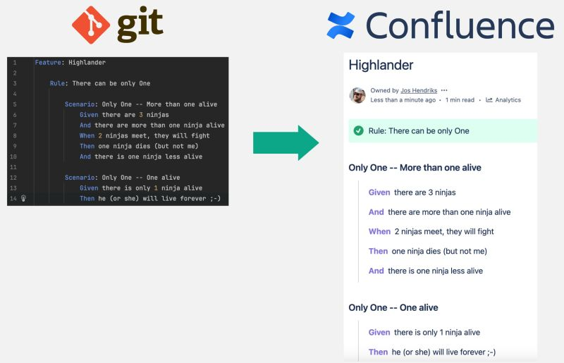

# SpecBridge

**SpecBridge** is a tool designed to synchronize Gherkin specification files (`.feature`) with Atlassian Confluence. By leveraging SpecBridge, teams can maintain **living documentation**, ensuring that Gherkin specifications are always up-to-date, shareable, and accessible to all stakeholders.

Living documentation allows teams to align better, bridge the gap between business and development, and ensure specifications evolve alongside the codebase and requirements.



## Key Features
- Automatically indexes `.feature` files from specified directories.
- Creates and updates Confluence pages for each `.feature` file.
- All generated pages are organized as child pages under a specified parent page in your Confluence space.

## Prerequisites
Before using SpecBridge, ensure that you have the following:
1. **API Token**: An Atlassian API token with access to the desired Confluence space. You can generate one [here](https://id.atlassian.com/manage-profile/security/api-tokens).
2. **Pre-created Parent Page**: A page in the Confluence space under which SpecBridge will create child pages for the specifications.

## How It Works
1. SpecBridge scans the specified directories for `.feature` files.
2. Each `.feature` file is converted into a Confluence page.
3. The pages are created following the same structure as the Gherkin files are organised starting under single parent page (provided by its Page ID in the configuration).

## Installation

SpecBridge is a `.NET` tool, which means you’ll need to have the **.NET SDK** (6.0 or higher) installed on your machine to use it. You can install the SDK from the official .NET website: [https://dotnet.microsoft.com/](https://dotnet.microsoft.com/).

To install SpecBridge globally as a .NET tool, use the following command:

```sh
dotnet tool install --global SpecBridge
```

To check if SpecBridge is installed correctly, run:

```sh
SpecBridge --version
```

## Usage

SpecBridge is **not limited to .NET projects** and works with any Gherkin `.feature` files, regardless of the programming language or framework. You can use it for Ruby, Python, Java, or any other language that uses Gherkin-style `.feature` files.

To run SpecBridge, use the command-line arguments provided below:

```
  -f, --features    paths to feature files. default is './'
  --url             Required. atlassian base url, for example
                    'https://nwwz.atlassian.net'
  --space           Required. atlassian space key, for example 'SpecBridge'
  --page            Required. id of the page under which to place the
                    specifications
  --user            Required. username to authenticate with
  --token           Required. token to authenticate with
  --help            Display help screen.
  --version         Display version information.
```

## Additional Notes
- Ensure that the specified directory for the `--features` option contains `.feature` files.
- Use a Confluence API token (not your password) for authentication.
- The specified Page ID should refer to an already existing page in the target Confluence space.

## License
This project is licensed under BSD 3-Clause. See the LICENSE file for details.